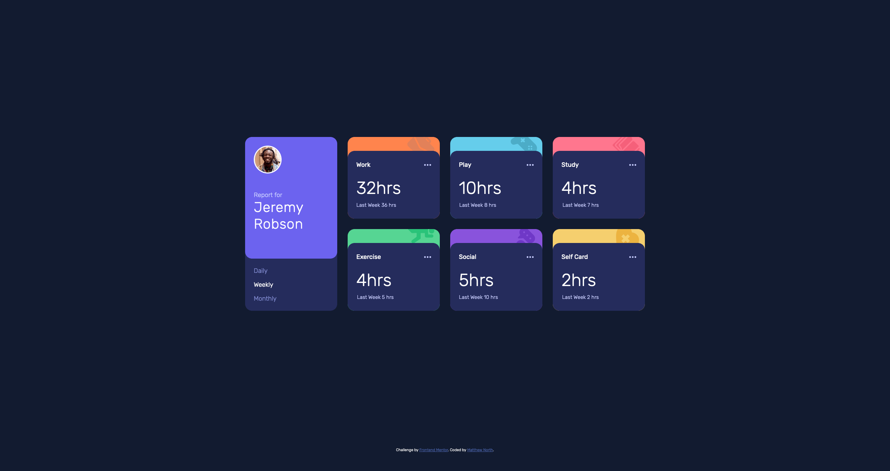

# Frontend Mentor - Time tracking dashboard solution

This is a solution to the [Time tracking dashboard challenge on Frontend Mentor](https://www.frontendmentor.io/challenges/time-tracking-dashboard-UIQ7167Jw). Frontend Mentor challenges help you improve your coding skills by building realistic projects. 

## Table of contents

- [Overview](#overview)
  - [The challenge](#the-challenge)
  - [Screenshot](#screenshot)
  - [Links](#links)
- [My process](#my-process)
  - [Built with](#built-with)
  - [What I learned](#what-i-learned)
  - [Continued development](#continued-development)
  - [Useful resources](#useful-resources)
- [Author](#author)


## Overview

### The challenge

Users should be able to:

- View the optimal layout for the site depending on their device's screen size
- See hover states for all interactive elements on the page
- Switch between viewing Daily, Weekly, and Monthly stats

### Screenshot




### Links

- Solution URL: [Github](https://github.com/MattInReality/time-tracking-dashboard-main)
- Live Site URL: [Netlify](https://fm001.mattnorth.dev/)

## My process

### Built with

- Semantic HTML5 markup
- CSS custom properties
- Flexbox
- CSS Grid
- Mobile-first workflow
- No libraries, just vanilla JS


### What I learned

I've not worked with CSS Grid much, flexbox has usually done the trick. Since the spec suggests it, I used it in 
the layout. It made the desktop layout super easy and removed the need for the wrapper divs I'd likely have needed to 
achieve the same thing with flex.

I put to use one of the selectors I picked up on Kevin Powells YouTube channel (linked below). 

```css
.class:not(.other-class) {} 
```

I also applied something I read some time ago about styling out form inputs and using the labels instead. I used 
that for the time frame selector. Using it simplified the JS as the selected element could be styled based on the 
input instead of toggling classes. I'll add the resource when I find it again.

### Continued development

This was an interesting first project from frontend mentor. Half the battle with testing my coding skills has always 
been working out what to code up. I'll likely pick something a more difficult for my next project and just carry on 
putting myself to the test. It will likely be a framework solution so I can put my JS skills to good use. 

Long term though I really want to branch out, learn some other languages and do more backend stuff too. 

### Useful resources

- [Kevin Powells YouTube Channel](https://www.youtube.com/kepowob) - I watch this channel from time to time. It's a 
  brilliant resource for the CSS you won't pick up in the average Udemy course.

## Author

- Website - TBC
- Frontend Mentor - [@MattInReality](https://www.frontendmentor.io/profile/MattInReality)
- Twitter (lurker/inactive) - [@MattNorth_dev](https://www.twitter.com/MattNorth_dev) 


